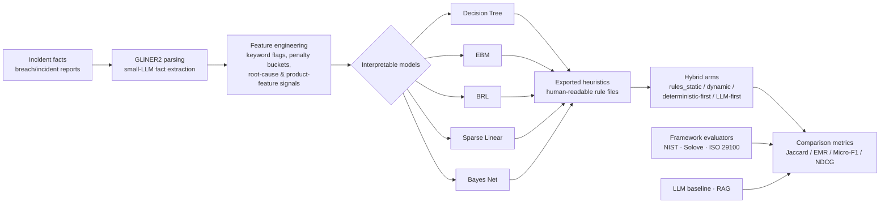

# privacy-harm-heuristics

[](https://github.com/Savage-Fred/privacy-harm-heuristics/actions/workflows/ci.yml)

Can a small pipeline estimate the *privacy harm* of an incident using interpretable
heuristics, and how does that compare to asking a large language model directly?
This repository is the frozen companion artifact to the masters practicum
**"Human vs Human vs Machine"** (Dec 2025). It collects public
breach/incident reports, labels them against Solove's harm taxonomy, engineers
features, trains a portfolio of interpretable models that export human-readable
heuristics, and evaluates those heuristics head-to-head against LLM baselines and
LLM-applied classical privacy frameworks.

## Research questions

The practicum set out to answer two questions, stated here verbatim:

1. **"Can we estimate privacy harm in general using heuristics, given a set of
   facts parsed by a small LLM?"**
2. **"How do non-language models compare vs LLMs vs an LLM applying classical
   privacy frameworks?"**

## Headline result

Recorded run — `data/experiments/final_results_summary.md`, dated **2025-11-06**,
n=50 gold cases (`golden_cases_v3.jsonl`), Solove taxonomy normalized to 4
high-level harm categories, LLM arms served by Gemini, 5 trials per mode
(mean scores):

| Mode | Instance Jaccard | Exact Match Ratio | Micro F1 | Ranking NDCG@5 |
| :--- | :--- | :--- | :--- | :--- |
| **Rules Static** | **0.0678** | **0.6667** | **0.3908** | **0.0896** |
| Baseline (LLM) | 0.0556 | 0.6200 | 0.2853 | 0.0716 |
| Rules Dynamic | 0.0547 | 0.5933 | 0.2807 | 0.0732 |
| Hybrid (Deterministic first) | 0.0533 | 0.5933 | 0.2752 | 0.0681 |
| RAG | 0.0467 | 0.5800 | 0.2424 | 0.0609 |
| Hybrid (LLM first) | 0.0361 | 0.6000 | 0.1949 | 0.0492 |

In this run the deterministic `rules_static` mode led every metric — a static
block of regex/keyword privacy heuristics injected into the prompt beat the plain
LLM baseline, RAG, and both hybrid combinations. The absolute numbers are low
because the task is hard (multi-label harm assignment over a sparse taxonomy);
the *ranking* of approaches is the finding.

### Reproducing these numbers

Be clear about what the offline reproduce path does and does not give you:

- `make reproduce` runs the **full comparison mechanics deterministically and
  offline** — the framework evaluators (NIST/Solove/ISO 29100), the metric
  computation, and every hybrid-mode arm — with **no API key and no network
  call**. It always completes.
- It will **not** reproduce the headline table, and `make reproduce` says so and
  exits non-zero rather than fudging a match. Reason: `rules_static` is not a pure
  classifier. Every arm — including the "static" ones — still calls an LLM to
  extract the final labels; "static" only describes the rules text injected into
  the prompt. Offline, the provider falls back to a truncated echo of the prompt
  instead of JSON, so the parsed harm sets come out empty and the metrics collapse
  to near-zero. The recorded numbers above were produced by a live cloud LLM call.
  See the `reproduce` docstring in `src/privacy_harm_heuristics/cli.py` for the
  full root-cause writeup.
- The recorded numbers also came from an **unpinned** cloud model in late 2025 —
  the experiment logs recorded only `provider: gemini`, with no model string. A
  pinned re-run on **2026-07-21** (`gemini-2.5-flash`, same `rules_static` arm,
  same n=50 gold set) lands in the **same regime** but with **materially drifted**
  values — full table and analysis in
  [`data/experiments/rerun_20260721/README.md`](data/experiments/rerun_20260721/README.md):

  | metric | recorded (late 2025, model unpinned) | rerun 2026-07-21 (`gemini-2.5-flash`) |
  | :--- | :--- | :--- |
  | instance_jaccard | 0.0678 | 0.1052 |
  | exact_match_ratio | 0.6667 | 0.3600 |
  | micro_f1 | 0.3908 | 0.3356 |
  | ndcg@5 | 0.0896 | 0.1760 |

  Today's model predicts non-empty harm sets far more often than the late-2025
  model, so exact-match (dominated by empty-set agreement) roughly halves while
  Jaccard and NDCG roughly double. This is presented as a **finding about
  evaluating against moving cloud LLMs**, not an apology: a headline number pinned
  to an unversioned hosted model is not reproducible by construction. The lesson
  applied here is to pin the model string and treat the recorded table as a dated
  historical artifact.

- Because the LLM arms are not offline-reproducible, this repo also ships an
  `offline_deterministic` arm (added in wave P3-D): a genuinely pure-rules
  classifier wired from the keyword/regex scoring engine, with **no LLM in the
  loop**, so `make reproduce` has at least one arm whose numbers are byte-stable on
  a fresh clone with no API key. Its metrics are recorded alongside the arms above:

  | Arm | Instance Jaccard | Exact Match Ratio | Micro F1 | Ranking NDCG@5 |
  | :--- | :--- | :--- | :--- | :--- |
  | Offline Deterministic (keyword rules) | 0.0808 | 0.0800 | 0.2222 | 0.1623 |

  Its profile is honest about what pure keyword rules do: they almost never
  predict an *empty* harm set, so exact-match collapses (the gold set is
  empty-majority) while Jaccard and ranking are competitive with the recorded
  LLM arms — byte-identical on every run.

## Architecture



Facts are parsed by a small LLM (GLiNER2), turned into features, and fed to five
interpretable model families. Each model exports human-readable heuristics; those
heuristics feed the hybrid arms, which are scored on the same gold set as the LLM
baseline, the RAG arm, and the classical-framework evaluators.

## Quickstart

```bash
git clone https://github.com/Savage-Fred/privacy-harm-heuristics.git
cd privacy-harm-heuristics
make setup        # create .venv and install with [dev,models] extras
make reproduce    # run the offline headline comparison + --check (see caveat above)
```

Other targets:

- `make train` — retrain the five interpretable models on the committed feature
  sample (`data/with_features.sample.jsonl`); `brl`/`bayes_net` skip cleanly if
  their optional deps aren't installed.
- `make fetch-data` — download the full feature corpus (`with_features.jsonl`,
  211 MB) as a `v1.0.0` GitHub **release asset** and verify it against
  `data/CHECKSUMS.txt`. This fails with a clear message until the `v1.0.0` tag is
  published; the committed sample is enough for `make reproduce` and `make train`.

## Repo map

| Path | Contents |
| :--- | :--- |
| `src/privacy_harm_heuristics/` | The package: `cli.py`, `models/` (trainers + hybrid modes), `labeling/`, `features/`, `llm/`, `evals/` (framework comparison), `science/` (scoring, evaluate, calibrate), `nlp/`, `rules/`, `processing/`. |
| `data/` | Gold sets, feature samples, rule sets, calibration weights, experiment summaries, checksums — see [`data/README.md`](data/README.md). |
| `docs/` | Extracted practicum docs — start at [`docs/OVERVIEW.md`](docs/OVERVIEW.md). |
| `heuristics/` | Human-readable rule files exported by the trained models. |
| `trained_models/` | Six model checkpoints (`decision_tree_v4`, `ebm_v4`, `sparse_linear_v3`, `bayes_net_v4`, `brl_v3`, `brl_cascade_v3`), each with `metrics.json` / `provenance.json`. |
| `tests/` | pytest suite (runs offline; `-m "not slow"` skips heavy training). |
| `scripts/` | `make_samples.py` — deterministically regenerate the committed `*.sample.jsonl`. |
| `Makefile` | `setup` / `train` / `reproduce` / `fetch-data` / `test` / `lint`. |
| `.github/workflows/ci.yml` | Lint (ruff), format check (black), type check (mypy), tests. |

## Data provenance & sampling

All records derive from the practicum's public breach-report / incident collection
pipeline (HHS breaches, SEC filings, Hacker News, Reddit, Mastodon, Wikipedia,
state portals, ransomware-leak trackers, Kaggle datasets). Labels are
Solove-taxonomy harm categories assigned by a mix of weak supervision, trained
interpretable models, and LLM judges during the practicum. Full provenance, the
per-file size/status table, and the sampling method are in
[`data/README.md`](data/README.md); checksums for every file (and the release
asset) are in [`data/CHECKSUMS.txt`](data/CHECKSUMS.txt).

What ships where:

- **Committed** — the gold eval sets (`golden_cases*.jsonl`,
  `golden_with_features.jsonl`), rule sets, calibration weights, the trimmed
  experiment summaries, and stratified **samples** of the large corpora
  (`with_features.sample.jsonl`, `labeled_gliner2.sample.jsonl`). No committed
  file exceeds ~25 MB.
- **Release asset (not committed)** — the full feature-engineered corpus
  `with_features.jsonl` (211 MB) ships as a `v1.0.0` GitHub release asset via
  `make fetch-data`. No Git LFS is used.
- **Omitted** — the full GLiNER2-labeled corpus `labeled_gliner2_full.jsonl`
  (159 MB) is not released; use its `.sample.jsonl` for reproduction.

Samples are regenerable byte-for-byte with a fixed seed
(`python scripts/make_samples.py`).

## Paper

The practicum paper, **"Human vs Human vs Machine"** (Dec 2025), is the primary
writeup of the experiment and its findings. <!-- Drive link: Will to insert -->

## Relationship to other work

This repository is part of the **Agentic Privacy** umbrella and is the **frozen
practicum artifact** — extracted and stabilized for reference, not under active
development. The successor line of work (a contextual-integrity judge and a
disclosure ledger) lives elsewhere and does not depend on this code.

## License & citation

Released under the [MIT License](LICENSE).

```bibtex
@software{privacy_harm_heuristics_2025,
  title        = {privacy-harm-heuristics: interpretable heuristics for estimating privacy harm},
  author       = {Will},
  year         = {2025},
  note         = {Companion artifact to the masters practicum
                  ``Human vs Human vs Machine'' (Dec 2025)},
  url          = {https://github.com/Savage-Fred/privacy-harm-heuristics}
}
```
